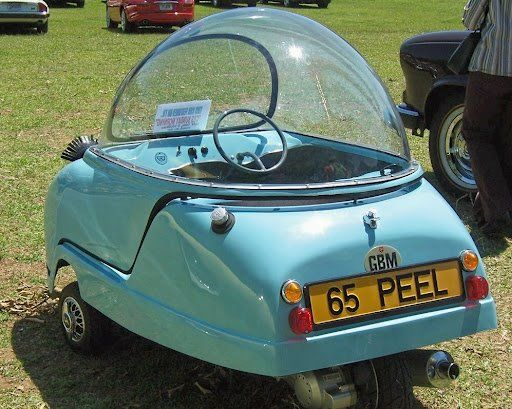

# Show and Tell

## Grids and Stuff

### Another Topic

Here I will be talking a little bit about creating Grids! I just recently discovered flex boxes and someone told me about grids so I thought I should scratch the surface of Grids.

make | boxes | now
1 | 2 | 3 
do | some | thing

Test Image


Testing Language
```css
.test {
  margin: 10px;
}
```
