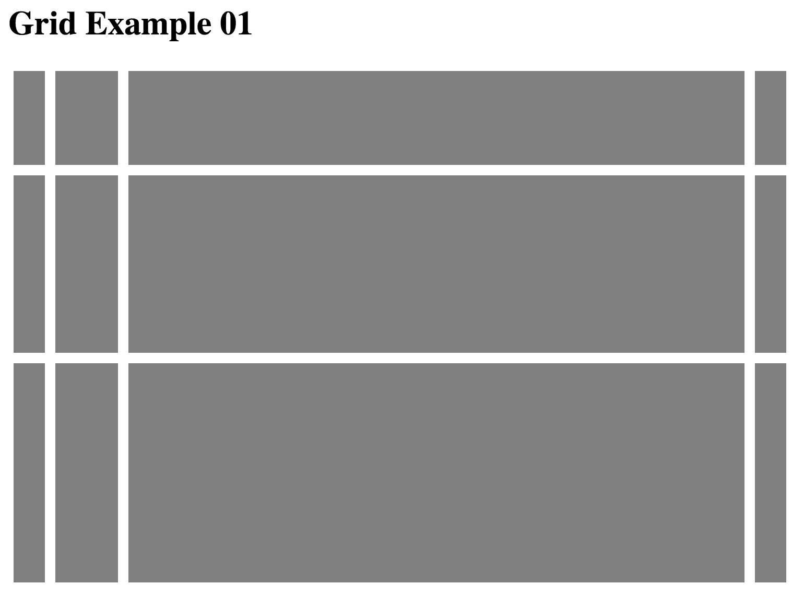
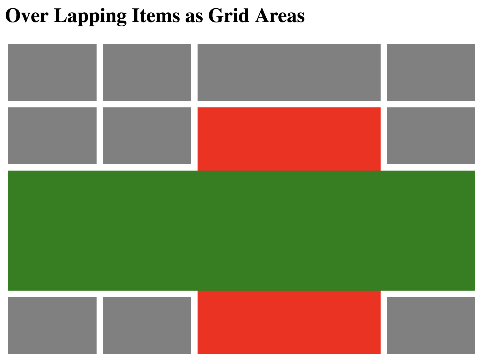

# Show and Tell

Here I will be talking a little bit about creating Grids! I just recently discovered flex boxes when first starting Prime and really enjoyed the possibilities that could be created. Recently when I mentioned my discovery they told me to take a glance into grids. In this assignment I am going to scratch the surface of Grids!

## Grids and Stuff

Grids were created to simply allow for variations in laying out user interfaces that work on a grid system. While your mind might jump to something similar to a spreadsheet or table of information, turns out much of what we use on our devices are aligned to carefully calculated ratios placed on a grid system. CSS has come a long way from tables and often require a little bit of finagling of floats, autos, and flex boxes. I should add I just learned that Grids and Flex boxes work really well together according to some resources I have found.

### Columns and Rows

Grids function on Columns and Rows which is pretty straight forward. Coding them in CSS is rather straight forward as well. You simply list the spacing you would like to see for each column and each row. Examples you can use are px, auto, or fr (fraction of the container). See this quick example text of CSS:

```CSS
.containername {
  grid-template-columns: 40px 70px auto 40px;
  grid-template-rows: 100px 180px auto;
}
```



If you have an interest in laying out your code to label a row or column you may do so by writing them with brackets before you define the property.

```CSS
.containername {
  grid-template-columns: [nav1] 40px [col02] 70px [info] auto [line4]40px;
  grid-template-rows: [topimage] 100px [bob] 180px [leftovers] auto;
}
```

`fr`is a new concept to me which I rather enjoy. When you apply `fr` it will divide the container into the fractions that are listed. For example say you would like the columns to be divide into 4 different sections but you want the second column to be double the width than the rest.

```CSS
.containername {
  grid-template-columns: 1fr 2fr 1fr 1fr;
}
```


### Working with a Grid Layout

Grids are rather interesting and can do many different tricks that have been rather perplex in the past. Last I will end with something that is very fascinating for myself. Grids have the ability to not only divide space but create the opportunity to fill out multiple spaces per item and even overlap items.

```CSS
.item01 {
  grid-area: <name> | <row-start> / <column-start> / <row-end> / <column-end>;;
}
```


Overlapping items example:



If you want to learn more about grids in css there is plenty more to discover.
